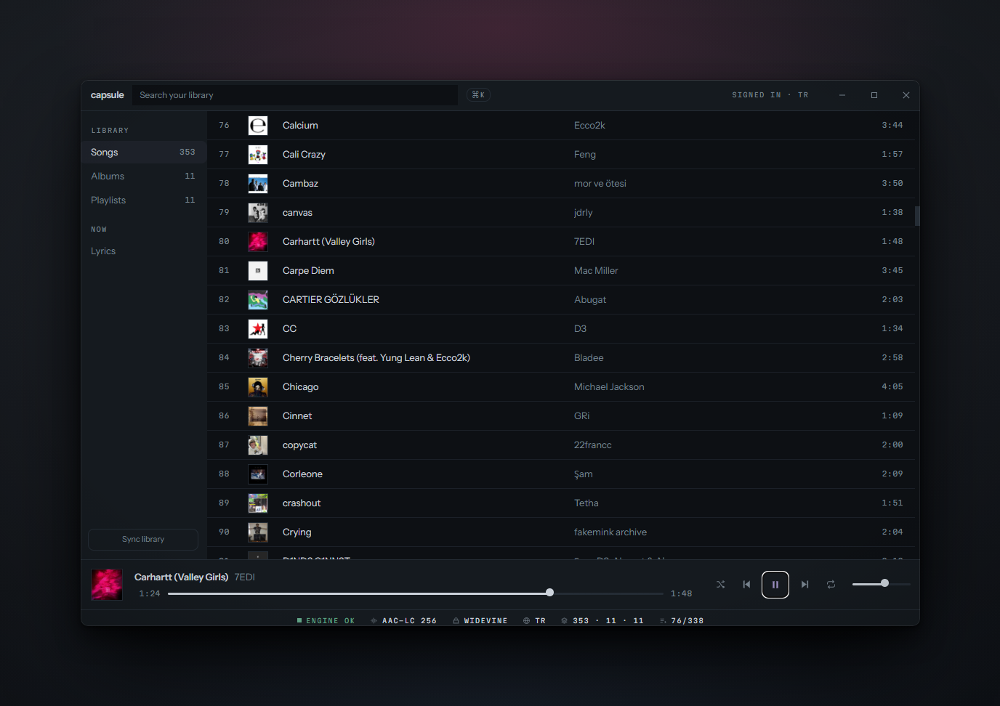
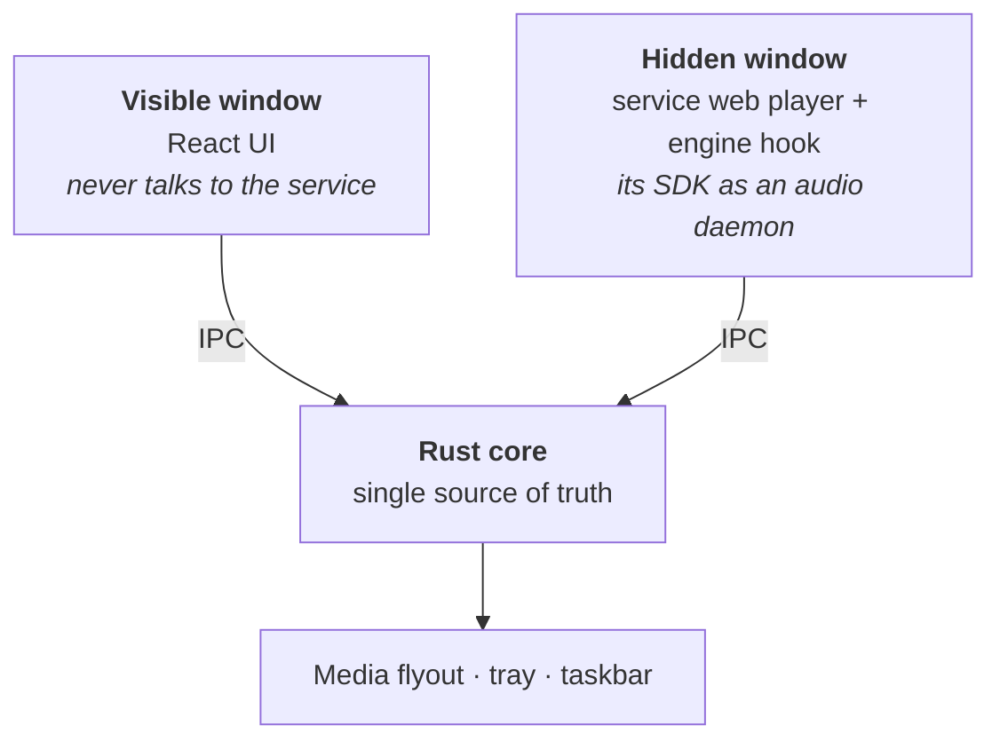

# capsule

A fast music client for Windows & Linux. Rust core, native `.exe`, no bundled Chromium.

One player for whichever service your music actually lives in streaming or
your own files. The speed comes from keeping the network off the UI path:
library metadata is mirrored into local SQLite, artwork is cached on disk, and
lists are virtualised.



> **Status:** early. Apple Music, local files and Navidrome work end to end
> roughly **0.8s from double-click to audio** on a warm start. Spotify is not
> built yet. Expect rough edges.

## Sources

One source is active at a time, chosen in `config.toml`.

| Source | State | Notes |
|---|---|---|
| **Apple Music** | working, Windows only | Needs a subscription; 256kbps AAC, no lossless. Widevine is not available in the Linux webview |
| **Local files** | working on both platforms | Folder scan, tags via `lofty`, FLAC/ALAC via `symphonia` no webview, and the only path to real lossless |
| **Navidrome** | working on both platforms | Subsonic API; plain HTTP, no DRM, decodes in Rust with no webview |
| **Spotify** | planned | Requires Premium and their Web Playback SDK, with the same DRM constraints as Apple |

Local files and Navidrome share nothing with a streaming source no catalog
ids, no tokens, no webview which is what forced the playback abstraction to be
honest rather than shaped around one service.

## Requirements

**Windows 10/11**

- WebView2 **Evergreen** runtime (preinstalled on Windows 11). A *fixed-version*
  runtime will fail with an expired Widevine licence

**Linux** (x86_64; built and tested on Ubuntu 22.04)

- `webkit2gtk-4.1` Tauri's webview
- `libasound2` ALSA, what audio decodes through
- `libdbus-1` the credential store and MPRIS both speak D-Bus
- `libayatana-appindicator3` (or `libappindicator3`) system tray
- A Secret Service provider running gnome-keyring or KWallet. Without one,
  nothing you sign in to is remembered between launches

The `.deb` pulls these in. For the `.AppImage` install them yourself.

**Both**

- For streaming sources: an **active subscription** to that service without
  one you get 30-second previews

Apple Music is Windows-only: it needs Widevine, which the Linux webview does not
have. Local files and Navidrome run on both. The acrylic and mica window
materials are Windows-only too, and fall back to the solid theme.

## Getting started

There are [published builds](https://github.com/yvesdeniz/capsule/releases), but if you wanna you compile it yourself. Beyond the
requirements above you need:

- **Rust 1.82+** via [rustup](https://rustup.rs)
- **Bun** via [bun.sh](https://bun.sh)
- **On Windows: MSVC C++ build tools** Tauri links against them. Installed with
  Visual Studio, or standalone with the *Desktop development with C++* workload
- **On Linux: the `-dev` packages** for the libraries above, plus
  `build-essential`, `patchelf`, `librsvg2-dev` and `libxdo-dev`. The exact
  `apt-get` line CI uses is in `.github/workflows/release.yml`

```bash
git clone https://github.com/yvesdeniz/capsule.git
cd capsule
bun install
bun run app
```

The first compile pulls the whole Rust dependency tree and takes a few minutes.
Later runs start in seconds. For an installer instead of a dev window:

```bash
bun run app:build    # installer under src-tauri/target/release/bundle/
                     # NSIS on Windows, .deb and .AppImage on Linux
```

### First run

1. **Sign in.** A window opens on the service's own login page capsule has no
   login form and never sees your password. Tokens go to the OS credential
   store. If you dismiss it, **Open sign-in** brings it back.
2. **Sync your library.** Press **Sync library** in the sidebar. This mirrors
   catalog metadata into local SQLite and caches artwork to disk; it is the one
   slow step, and it is why later startups don't touch the network.
3. **Play.** Double-click any track. `Ctrl+K` opens the command palette.

A muted track plays automatically at startup that is deliberate, and the
reason is under [Honest caveats](#honest-caveats).

Nothing else is required. `config.toml` is written on demand in the data
directory (see [Configuration](#configuration)), and Last.fm or Discord Rich
Presence stay off until you supply keys. Those two are read at **compile
time**, so copy `.env.example` to `.env` and fill it in *before* building
changing them later means rebuilding.

## What it does

- **Library** songs, albums and playlists mirrored locally; search and a
  `Ctrl+K` command palette
- **Playback** queue, shuffle, repeat, seek, volume
- **Lyrics** time-synced, from [LRCLIB](https://lrclib.net), with dots through
  intros and instrumental breaks and a one-time timing calibration
- **Desktop integration** system tray and a frameless window on both platforms.
  Windows also gets the media flyout (SMTC) and hardware media keys, taskbar
  thumbnail controls and Snap Layouts
- **Optional** Last.fm and Discord Rich Presence, once keys are supplied

## How it works

A Rust core owns all state; sources plug in behind it. DRM-backed streaming is
the awkward case it needs a second, hidden webview, because the playback SDK
requires Widevine and its token is bound to the service's own origin:



The hidden window is the service's own web player, invisible, reduced to an
audio daemon. The UI you see is entirely ours and never talks to the service
directly.

Local files and Navidrome need none of this they decode in Rust with no
webview at all, which is why they are also the only routes to lossless.

Because Rust holds the only copy of playback state, the UI, the media flyout,
the taskbar buttons and the scrobbler can't drift out of sync and a new source
only has to satisfy that core, not the interface.

## Configuration

Settings live in `config.toml`, next to the library in the data directory
`%APPDATA%\com.deniz.capsule\` on Windows, `~/.local/share/com.deniz.capsule/`
on Linux. It is created on demand and safe to hand-edit a partial file is
fine, and anything malformed falls back to defaults rather than refusing to
start.

```toml
source = "apple"     # apple | local | navidrome | spotify

[navidrome]
url = ""             # https://music.example.com
username = ""        # the password lives in the OS credential store, not here

[lyrics]
offset_ms = 0        # timing calibration, set from the lyrics view

[lastfm]
api_key = ""         # register an application at last.fm/api
shared_secret = ""

[discord]
client_id = ""
```

Secrets are never written here. Service tokens and passwords go to the OS
credential store Credential Manager on Windows, Secret Service (gnome-keyring
or KWallet) on Linux so this file is safe to share when reporting a bug.

## Honest caveats

These come from streaming DRM, mostly not from the app. Local files and
Navidrome avoid nearly all of them.

**Streaming quality is capped at 256kbps AAC.** Measured, not assumed: EME
negotiates `com.widevine.alpha` for `mp4a.40.2`, and the playback SDK offers
only 64 and 256. Lossless streams are reserved for first-party clients, which
binds every third-party player. Lossless comes with local files.

**Apple Music sits around 1 GB while streaming.** The Rust core is ~70 MB of
that; the rest is WebView2 and Apple's own web app, which is the price of the
DRM path. Local files and Navidrome need no webview and sit nearer **200 MB**,
less once the window is in the tray.

**The default token path is unofficial.** The app reuses the developer token the
service ships in its own web page. It works, but that bundle can change and
break it. Supply your own key if you hold a developer membership see
`.env.example`.

**Streaming playback has three quirks worth knowing.** A muted track plays at
startup (there is no way to warm the DRM path without playing it saves ~5s on
your first real play, but may show in your listening history). *Previous track*
only reaches back to where you started, since the queue is built forward from
your click. And tracks the catalog can't resolve are skipped silently, because
the SDK rejects an entire queue if any single track fails.

**Your Apple credentials never touch this app.** Sign-in happens on Apple's own
login page inside the engine window. No login form here, no password seen or
stored, tokens in the OS credential store.

**Navidrome is different, and cannot be otherwise.** Subsonic authenticates
every request with `md5(password + salt)`, so the app has to hold your actual
password rather than a token derived from it. It goes to the OS credential
store and never to `config.toml` but it is a real password at rest, and
over plain `http://` the derived token can be replayed by anyone on the
network. The connect screen says so when your URL is not HTTPS.

## Development

Setup is the same as [Getting started](#getting-started). Useful while
debugging:

```bash
SHOW_ENGINE_WINDOW=true bun run app          # un-hide the playback webview
CAPSULE_GLASS=acrylic-chrome bun run app     # window transparency variants
```

Tests and checks:

```bash
cd src-tauri && cargo test && cargo clippy --all-targets -- -D warnings
bun run typecheck && bun run test
```

The taskbar buttons in `src-tauri/icons/thumb/` are separate 16–32px `.ico`
files, embedded at compile time swap them for any icon set you like.

### Adding a command

A Tauri command must be registered in **three** places or it compiles fine and
is denied at runtime with `not allowed. Command not found`:

1. `generate_handler!` in `src-tauri/src/lib.rs`
2. the command list in `src-tauri/build.rs` this generates the `allow-*`
   permission
3. the matching `allow-<command>` entry in `src-tauri/capabilities/main.json`

## Getting help

**[Discord](https://discord.gg/77np9hVV7M)** for questions, setup trouble, and anything
that is easier to work out in conversation.

**[Issues](https://github.com/yvesdeniz/capsule/issues)** for bugs and feature
requests, so they do not scroll away.

If you are reporting something broken, turn on **Developer mode** in Settings
and press **Copy diagnostics**. It reports which source is active, which backend
is live, your library counts and what the player thinks it is doing. Your server
address, username and passwords are not included, so it is safe to paste in
public.

`config.toml` is safe to share too - every secret lives in the OS credential
store, never in that file.

## Licence

GPL. See [LICENSE](LICENSE).

Not affiliated with or endorsed by Apple. Apple Music is a trademark of Apple Inc.
