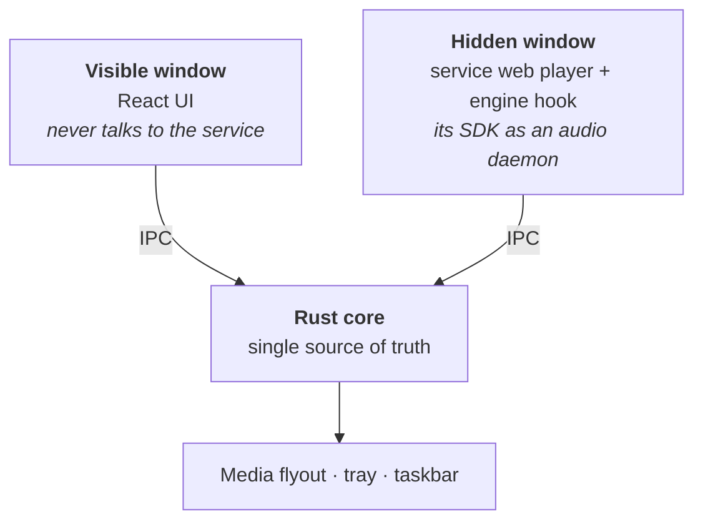

# capsule

A fast music client for Windows. Rust core, native `.exe`, no bundled Chromium.

One player for whichever service your music actually lives in — streaming or
your own files. The speed comes from keeping the network off the UI path:
library metadata is mirrored into local SQLite, artwork is cached on disk, and
lists are virtualised.

> **Status:** early. The first streaming source works end to end — roughly
> **0.8s from double-click to audio** on a warm start. The rest are not built
> yet. Expect rough edges.

## Sources

One source is active at a time, chosen in `config.toml`.

| Source | State | Notes |
|---|---|---|
| **Apple Music** | working | Needs a subscription; 256kbps AAC, no lossless |
| **Local files** | planned | FLAC/ALAC via `symphonia` — no webview, and the only path to real lossless |
| **Navidrome** | planned | Subsonic API; plain HTTP, no DRM |
| **Spotify** | planned | Requires Premium and their Web Playback SDK, with the same DRM constraints as Apple |

Local files are next, because they share nothing with a streaming source — no
catalog ids, no tokens, no webview — which is what forces the playback
abstraction to be honest rather than shaped around one service.

## Requirements

- Windows 10/11
- WebView2 **Evergreen** runtime (preinstalled on Windows 11). A *fixed-version*
  runtime will fail with an expired Widevine licence
- For streaming sources: an **active subscription** to that service — without
  one you get 30-second previews

## What it does

- **Library** — songs, albums and playlists mirrored locally; search and a
  `Ctrl+K` command palette
- **Playback** — queue, shuffle, repeat, seek, volume
- **Lyrics** — time-synced, from [LRCLIB](https://lrclib.net), with dots through
  intros and instrumental breaks and a one-time timing calibration
- **Windows integration** — media flyout (SMTC) and hardware media keys, system
  tray, taskbar thumbnail controls, frameless window with Snap Layouts
- **Optional** — Last.fm and Discord Rich Presence, once keys are supplied

## How it works

A Rust core owns all state; sources plug in behind it. DRM-backed streaming is
the awkward case — it needs a second, hidden webview, because the playback SDK
requires Widevine and its token is bound to the service's own origin:



The hidden window is the service's own web player, invisible, reduced to an
audio daemon. The UI you see is entirely ours and never talks to the service
directly.

Local files and Navidrome need none of this — they decode in Rust with no
webview at all, which is why they are also the only routes to lossless.

Because Rust holds the only copy of playback state, the UI, the Windows media
flyout, the taskbar buttons and the scrobbler can't drift out of sync — and a
new source only has to satisfy that core, not the interface.

## Configuration

Settings live in `config.toml`, next to the library at
`%APPDATA%\com.deniz.capsule\`. It is created on demand and safe to hand-edit —
a partial file is fine, and anything malformed falls back to defaults rather
than refusing to start.

```toml
source = "apple"     # apple | local | navidrome | spotify

[lyrics]
offset_ms = 0        # timing calibration, set from the lyrics view

[lastfm]
api_key = ""         # register an application at last.fm/api
shared_secret = ""

[discord]
client_id = ""
```

Secrets are never written here. Service tokens and passwords go to Windows
Credential Manager, so this file is safe to share when reporting a bug.

## Honest caveats

These come from streaming DRM, mostly — not from the app. Local files and
Navidrome avoid nearly all of them.

**Streaming quality is capped at 256kbps AAC.** Measured, not assumed: EME
negotiates `com.widevine.alpha` for `mp4a.40.2`, and the playback SDK offers
only 64 and 256. Lossless streams are reserved for first-party clients, which
binds every third-party player. Lossless comes with local files.

**Memory sits around 1 GB while streaming.** The Rust core is ~70 MB of that;
the rest is WebView2 and the service's own web app. Sources that need no webview
won't pay it.

**The default token path is unofficial.** The app reuses the developer token the
service ships in its own web page. It works, but that bundle can change and
break it. Supply your own key if you hold a developer membership — see
`.env.example`.

**Streaming playback has three quirks worth knowing.** A muted track plays at
startup (there is no way to warm the DRM path without playing — it saves ~5s on
your first real play, but may show in your listening history). *Previous track*
only reaches back to where you started, since the queue is built forward from
your click. And tracks the catalog can't resolve are skipped silently, because
the SDK rejects an entire queue if any single track fails.

**Your credentials never touch this app.** Sign-in happens on the service's own
login page inside the engine window. No login form here, no password seen or
stored, tokens in Windows Credential Manager.

## Development

```bash
bun install
bun run app        # tauri dev
```

Useful while debugging:

```bash
SHOW_ENGINE_WINDOW=true bun run app          # un-hide the playback webview
CAPSULE_GLASS=acrylic-chrome bun run app     # window transparency variants
```

Tests and checks:

```bash
cd src-tauri && cargo test && cargo clippy --all-targets -- -D warnings
bun run typecheck && bun run test
```

The app icon is a placeholder. To replace it, drop in any square PNG and let
Tauri generate the full set:

```bash
bunx tauri icon path/to/icon.png
```

The taskbar buttons in `src-tauri/icons/thumb/` are separate 16–32px `.ico`
files, embedded at compile time — swap them for any icon set you like.

### Adding a command

A Tauri command must be registered in **three** places or it compiles fine and
is denied at runtime with `not allowed. Command not found`:

1. `generate_handler!` in `src-tauri/src/lib.rs`
2. the command list in `src-tauri/build.rs` — this generates the `allow-*`
   permission
3. the matching `allow-<command>` entry in `src-tauri/capabilities/main.json`

## Licence

MIT. See [LICENSE](LICENSE).

Not affiliated with or endorsed by Apple. Apple Music is a trademark of Apple Inc.
